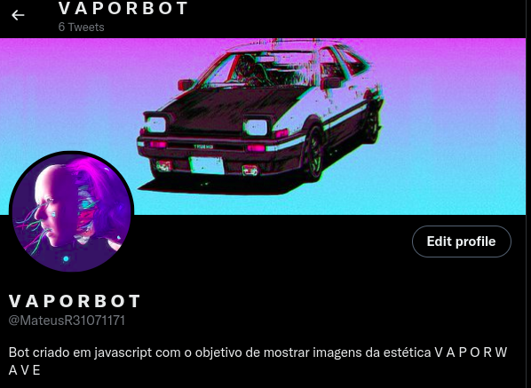

# vaporbot

# vaporbot

O vaporbot é um chatbot desenvolvido em javascript com auxílio do software node.js. Ele usa a API do twitter para enviar links de fotos do google imagens da estética vaporwave.

